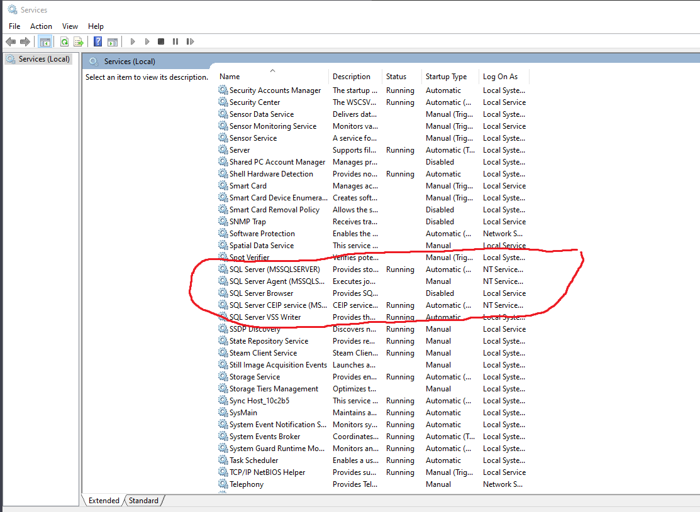
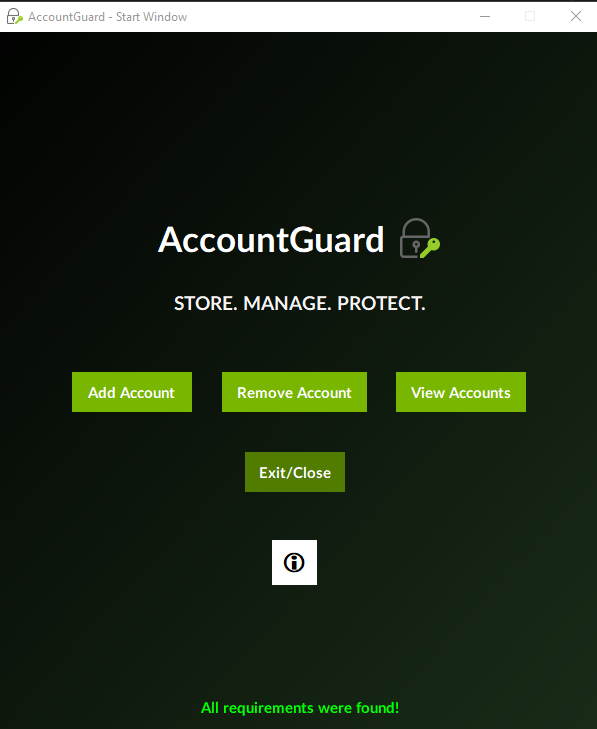

# AccountGuard_PyQt5

* THIS GUIDE IS DEDICATED TO WINDOWS USERS *

A easy-to-use account manager.                                                                                                                                                                                                                           
Created with PyQt5                                                                                                            
By Parker Phelps

----------------------
SETTING UP THE PROGRAM
----------------------

1. Make sure you have SQL server installed and its respected driver ({ODBC Driver 17 for SQL Server}) and also make sure that SQL is running. To check if SQL is running, do the following:
   - In the windows search bar, type "Services" and press enter.
   - Scroll to the bottom where you should see the following:
   
   

3. Download SSMS (SQL Microsoft Studio Management 19) - Download it to either the following locations:

   -   C:\Program Files\
   -   C:\Program Files (x86)\
   -   D:\
   
3. Connect to using the following:
   - Server Authentication: Windows Authentication
   - Login: localhost 
4. Create a new database called "AccountGuard_PyQt5".
5. Now you must create the "Accounts" table. There are 2 ways you can do this.
   - Easy Way: 
      Create a new query and copy and paste the "Database.sql" (backend/database/) contents into the query and execute it. Now the table for the program has been created.
   - Hard Way:
      Right click on AccountGuard_PyQt5 > Tables > New > New Table. Now add the following columns to the table:
      - ID: int - (In the columns properties, make sure that Identity Specification is set to Yes, 1, 1)
      - AccountType - varchar(MAX) - ALLOW_NULLS
      - AccountEmail - varchar(MAX) - ALLOW_NULLS
      - AccountPassword - varchar(MAX) - ALLOW_NULLS
                                                                                                                   
      Now save the table as "Accounts"

6. Now run the program's "run.exe" file. You should be seeing green text at the bottom that says "All requirements were found!", if you do see it, the program is working. If you see one of the following errors here is why:
   - "Both SSMS and ODBC were not found! Refer to the README.md for installation." = This means that neither SSMS or ODBC Driver 17 were found. You must install both in the proper location for it to be picked up (Perferred to install in there default locations via wizard)
   - "ODBC was not found! Download ODBC Driver 17 for SQL Server." = This means that ODBC Driver 17 was not found. You must install it in the proper location for it to be picked up (Perferred to install in its default location via wizard)

-------------------
RUNNING THE PROGRAM
-------------------
1. Download/ZIP the project.
2. Extract the "output" folder to another folder of your choosing (Wanna be clean dont we :D).
3. Open the "output/run" folder and execute the "run.exe" file.                                                                                                                                                                                                                                                                    
                               

